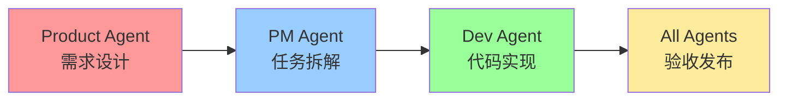

# 📚 Drink Master 文档中心

> 基于Agent协作框架的Go+Gin+MySQL饮品管理系统开发文档

## 🎯 快速导航

### 👥 角色入门指南
- **🤝 [角色协作总览](ROLES_COLLABORATION.md)** - 三角色协作模式核心指南
- **💻 [Dev Agent入门](AGENT_ONBOARDING.md)** - 开发代理标准工作流程
- **📊 [PM Agent入门](PM_ONBOARDING.md)** - 项目管理代理执行指南
- **🎯 [Product Agent入门](PRODUCT_ONBOARDING.md)** - 产品策略代理设计指南

### 🛠️ 开发方法论
- **📋 [任务依赖规划](TASK_DEPENDENCY_PLANNING.md)** - DAG并行开发优化方法
- **🔀 [PR合并指南](AGENT_PR_MERGE_GUIDE.md)** - 安全自动化合并流程

### 📁 文档组织结构
```
docs/
├── README.md                    # 📋 本文档 - 导航索引
├── ROLES_COLLABORATION.md       # 🤝 核心协作框架
├── AGENT_ONBOARDING.md         # 💻 Dev开发流程规范
├── PM_ONBOARDING.md            # 📊 PM管理流程规范  
├── PRODUCT_ONBOARDING.md       # 🎯 Product设计流程规范
├── TASK_DEPENDENCY_PLANNING.md # 📋 DAG依赖分析方法论
├── AGENT_PR_MERGE_GUIDE.md     # 🔀 PR合并安全指南
├── PRD/                        # 📄 产品需求文档
├── Sprint/                     # 📊 Sprint计划文档
├── Guides/                     # 📚 技术指南文档
└── Operations/                 # ⚙️ 运维操作文档
```

## 🚀 新Agent快速上手

### 1. 必读文档（按顺序）
1. **[ROLES_COLLABORATION.md](ROLES_COLLABORATION.md)** - 理解整体协作框架
2. **根据你的角色选择对应入门指南**：
   - Dev → [AGENT_ONBOARDING.md](AGENT_ONBOARDING.md)
   - PM → [PM_ONBOARDING.md](PM_ONBOARDING.md)
   - Product → [PRODUCT_ONBOARDING.md](PRODUCT_ONBOARDING.md)

### 2. 工作流程概览


### 3. 关键工具和命令
```bash
# GitHub项目管理
gh issue list --label "epic" --state open
gh project item-list <project-id>

# 开发质量检查
make lint && make test && make build

# 健康状态验证
make health-check && make test-api
```

## 📖 文档详细说明

### 🤝 协作框架文档
**[ROLES_COLLABORATION.md](ROLES_COLLABORATION.md)**
- 三角色职责边界定义
- 协作流程和交接标准
- 冲突避免和效率优化
- 成功指标和最佳实践

### 💻 开发流程文档
**[AGENT_ONBOARDING.md](AGENT_ONBOARDING.md)**
- 强制性开发工作流
- 分支管理和代码提交规范
- 质量检查和验收标准
- 常见问题故障排除

**核心开发约束**：
```bash
# 必须严格按此顺序执行
git checkout main && git pull origin main
git status  # 确认工作目录干净
gh issue view <issue-id>
git checkout -b feat/<issue-id>-<name>
make lint && make test && make build
```

### 📊 项目管理文档
**[PM_ONBOARDING.md](PM_ONBOARDING.md)**
- Epic创建和任务拆解方法
- 依赖规划和并行协调
- 进度跟踪和阻塞处理
- Sprint管理和发布协调

**PM日常检查清单**：
- [ ] 看板Blocked任务24h响应
- [ ] 里程碑进度风险预警
- [ ] 契约变更同步文档
- [ ] CI状态保持绿灯

### 🎯 产品设计文档
**[PRODUCT_ONBOARDING.md](PRODUCT_ONBOARDING.md)**
- 用户需求洞察和优先级
- PRD文档标准和模板
- 验收标准和成功指标
- 数据验证和产品迭代

**PRD输出标准**：
- ✅ 完整的`docs/PRD/<topic>.md`文档
- ✅ 明确的验收标准定义
- ✅ 可度量的成功指标
- ✅ 交互原型或线框图

### 🔧 方法论文档
**[TASK_DEPENDENCY_PLANNING.md](TASK_DEPENDENCY_PLANNING.md)**
- DAG依赖关系分析方法
- 并行开发机会识别
- 文件冲突预防策略
- 批次规划和协调流程

**依赖分析核心**：
- 硬依赖：必须串行等待
- 软依赖：建议顺序但可并行
- 文件冲突：需要协调避免

**[AGENT_PR_MERGE_GUIDE.md](AGENT_PR_MERGE_GUIDE.md)**
- 三级风险分类合并策略
- 自动化验证脚本和工具
- 紧急修复和回滚流程
- 安全检查和质量门禁

**风险分级**：
- 🟢 低风险：docs/style/test 自动合并
- 🟡 中风险：feat/fix/refactor 额外验证
- 🔴 高风险：contracts/db/security 人工审核

## 🏗️ 项目技术架构

### 技术栈
- **后端**: Go + Gin Framework
- **数据库**: MySQL 8.0+
- **ORM**: GORM (推荐) 或 database/sql
- **认证**: JWT-based authentication
- **部署**: Docker + CI/CD

### 核心目录结构
```
drink-master/
├── cmd/server/                  # 主程序入口
├── internal/                    # 内部包
│   ├── handlers/               # HTTP处理器 
│   ├── services/               # 业务逻辑层
│   ├── repositories/           # 数据访问层
│   ├── models/                 # 数据模型
│   ├── contracts/              # API契约定义
│   └── middleware/             # Gin中间件
├── pkg/                        # 可复用包
├── migrations/                 # 数据库迁移
├── docs/                       # 文档目录
├── Makefile                    # 开发命令
└── CLAUDE.md                   # Agent协作指南
```

### API设计原则
- RESTful接口设计
- 契约优先开发（Contract-First）
- 统一错误处理和响应格式
- 请求验证和边界检查

## 📈 质量标准

### 代码质量
- **Lint**: `make lint` (golangci-lint + go fmt + go vet)
- **Test**: `make test` (单元测试覆盖率 > 80%)
- **Build**: `make build` (编译验证)

### API标准
- **响应时间**: < 500ms
- **健康检查**: GET `/api/health`
- **错误处理**: 统一HTTP状态码和错误格式
- **文档**: 自动生成API文档

### 验收标准 (DoD)
- [ ] 功能完整实现且符合PRD要求
- [ ] 单元测试覆盖率 > 80%
- [ ] API响应时间 < 500ms
- [ ] 数据库事务一致性
- [ ] CI/CD流水线全部通过
- [ ] 相关文档同步更新

## 🎯 使用场景

### Product Agent场景
```bash
# 创建产品需求Issue
gh issue create --title "[Product] 用户饮品记录功能" --label "product,priority-high"

# 输出PRD文档
# 文件: docs/PRD/drink-tracking.md
# 内容: 用户价值、业务目标、功能需求、验收标准
```

### PM Agent场景
```bash
# 基于PRD创建Epic
gh issue create --title "[Epic] 饮品管理系统MVP" --label "epic,backend"

# 拆解开发任务
# - #XX 数据库模型设计
# - #XX 用户认证API
# - #XX 饮品CRUD功能
# - #XX API文档生成
```

### Dev Agent场景
```bash
# 标准开发流程
git checkout main && git pull origin main
gh issue view <issue-id>
git checkout -b feat/<issue-id>-drink-api
make lint && make test && make build

# 提交和PR创建
git commit -m "feat: implement drink CRUD API"
gh pr create --title "feat: drink CRUD API" --body "Fixes #<issue-id>"
```

## 🔍 常见问题

### Q: 如何处理并行开发中的文件冲突？
A: 参考 [TASK_DEPENDENCY_PLANNING.md](TASK_DEPENDENCY_PLANNING.md) 中的依赖分析和批次规划方法，提前识别冲突文件并协调开发顺序。

### Q: PR合并失败如何处理？
A: 查看 [AGENT_PR_MERGE_GUIDE.md](AGENT_PR_MERGE_GUIDE.md) 中的风险分类和处理流程，根据失败原因采取相应措施。

### Q: 如何确保代码质量标准？
A: 严格执行 [AGENT_ONBOARDING.md](AGENT_ONBOARDING.md) 中的质量检查流程，所有代码提交前必须通过 `make lint && make test && make build`。

### Q: 角色职责边界不清晰怎么办？
A: 详细阅读 [ROLES_COLLABORATION.md](ROLES_COLLABORATION.md)，明确三角色的专属职责和协作边界，避免重复工作。

## 📞 支持和反馈

如果文档有疑问或需要改进：
1. 在相关Issue中提出反馈
2. 直接修改文档并提交PR
3. 在团队沟通渠道讨论

---

**让我们通过标准化的协作流程，构建高质量的饮品管理系统！** 🚀

*文档最后更新：2025-08-11*