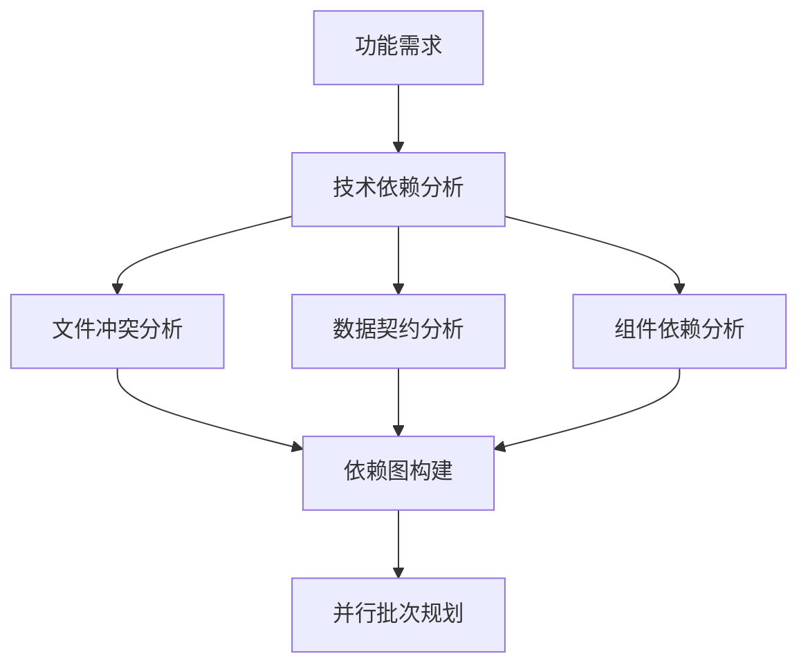
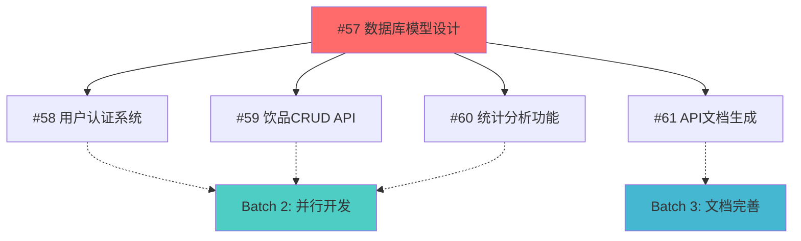
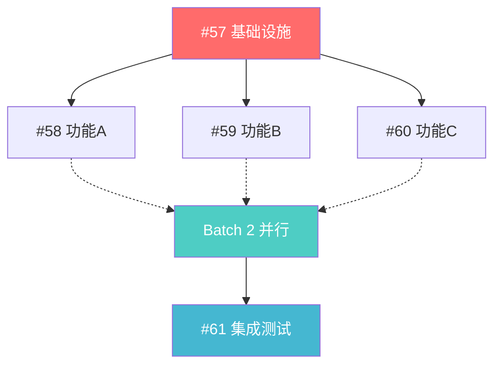

# 任务依赖规划指南（DAG-Based Task Planning）

> 基于有向无环图（DAG）的功能任务规划，优化并行开发效率，减少代码合并冲突

## 目标
- **最大化并行开发**：识别可并行执行的任务
- **最小化依赖冲突**：明确任务间的前置依赖关系  
- **减少合并复杂度**：避免多个分支同时修改相同文件
- **提升交付效率**：通过依赖图优化开发顺序

## 文档定位与适用场景

**本文档是方法论指南**：专注于DAG依赖分析的技术方法，不涉及具体角色职责。

**适用场景**：
- 复杂功能涉及多个组件和文件修改
- 需要多人并行开发的大型Epic  
- 存在明显技术依赖关系的任务集合
- 希望最大化开发效率的团队协作

**与角色文档的关系**：
- **ROLES_COLLABORATION.md**：定义"谁来做"
- **本文档**：提供"如何分析依赖"的具体方法
- **PM_ONBOARDING.md**：描述PM如何应用这些方法
- **AGENT_ONBOARDING.md**：规范Dev如何执行拆分后的任务

## 1. 任务依赖分析方法

### 1.1 依赖类型定义



**技术依赖**：
- **Hard Dependency（硬依赖）**：B任务必须等A任务完成
- **Soft Dependency（软依赖）**：B任务最好在A任务后，但可并行
- **File Conflict（文件冲突）**：两任务修改相同文件，需串行执行

**依赖标识方法**：
```yaml
# Issue 描述中的依赖标记格式
dependencies:
  hard:
    - "#57 数据库架构设计"  # 必须等待完成
  soft: 
    - "#58 用户认证模块"      # 建议等待，可并行
  conflicts:
    - "#59 API路由重构"    # 文件冲突，需协调
    
file_impacts:
  - "internal/models/user.go"          # 影响的核心文件
  - "internal/handlers/*"              # 影响的处理器目录
  - "internal/contracts/drink.go"      # 影响的契约文件
```

### 1.2 依赖图构建步骤

1. **功能拆分**：将Epic拆分为独立的功能单元
2. **文件影响分析**：识别每个任务影响的文件和目录
3. **契约依赖分析**：检查接口、结构体、数据库模型的依赖关系
4. **冲突检测**：发现文件级别的潜在冲突
5. **依赖图绘制**：使用Mermaid或类似工具可视化

## 2. 实际应用：饮品管理系统Epic示例

### 2.1 原始任务列表
- #57 数据库模型设计
- #58 用户认证系统
- #59 饮品CRUD API  
- #60 统计分析功能
- #61 API文档生成

### 2.2 文件影响分析

| 任务 | 影响文件 | 冲突风险 |
|-----|---------|----------|
| #57 数据库模型 | `internal/models/*.go`, `migrations/*.sql` | 高 |
| #58 用户认证 | `internal/handlers/auth.go`, `internal/middleware/auth.go` | 低 |
| #59 饮品CRUD | `internal/handlers/drinks.go`, `internal/services/drink.go` | 低 |
| #60 统计分析 | `internal/handlers/stats.go`, `internal/services/stats.go` | 中 |
| #61 API文档 | `docs/api.md`, `internal/handlers/*.go` (注释) | 无 |

### 2.3 依赖图重构



**批次规划**：
- **Batch 1**：#57（阻塞任务，必须先完成）
- **Batch 2**：#58, #59, #60（可并行开发）
- **Batch 3**：#61（文档任务，可与Batch 2并行）

## 3. GitHub Issue模板增强

### 3.1 依赖规划模板

```markdown
## 📋 任务基本信息
**Epic**: #XX [Epic名称]
**估时**: X天
**优先级**: P0/P1/P2
**标签**: `backend`, `api`, `docs`

## 🔗 依赖关系分析
### 前置依赖（Hard Dependencies）
- [ ] #XX 任务名称 - 原因说明

### 建议顺序（Soft Dependencies） 
- [ ] #XX 任务名称 - 建议原因

### 潜在冲突（File Conflicts）
- [ ] #XX 任务名称 - 冲突文件：`path/to/file.go`

## 📁 文件影响范围
**新增文件**：
- `path/to/new-file.go`

**修改文件**：
- `path/to/existing-file.go` - 修改原因

**删除文件**：
- `path/to/deprecated-file.go` - 删除原因

## 🚀 并行开发建议
**可与以下任务并行**：
- #XX, #XX, #XX

**建议延后的任务**：
- #XX - 等待本任务的输出

## ✅ 验收标准
- [ ] 功能验收点1
- [ ] 功能验收点2
- [ ] 文件冲突解决
- [ ] 集成测试通过
```

### 3.2 DAG依赖图表示方法

**标准Mermaid语法**：


**依赖关系符号约定**：
- `-->` : Hard Dependency (硬依赖，必须等待)
- `-.->` : Soft Dependency (软依赖，建议顺序)  
- `--x` : Conflict (冲突，不能并行)
- `===>` : Critical Path (关键路径)

**批次标识方法**：
```yaml
# 依赖关系YAML表示
dependencies:
  "#57": []                    # 无依赖，可立即开始
  "#58": ["#57"]              # 硬依赖#57
  "#59": ["#57"]              # 硬依赖#57  
  "#60": ["#57"]              # 硬依赖#57
  "#61": ["#58", "#59", "#60"] # 依赖所有功能完成

conflicts:
  - ["#58", "#59"]: "internal/middleware/cors.go"  # 文件冲突需协调
  
parallel_batches:
  batch_1: ["#57"]           # 基础设施
  batch_2: ["#58", "#59", "#60"]  # 功能开发(并行)
  batch_3: ["#61"]           # 集成收尾
```

## 4. 开发流程优化

### 4.1 分支命名策略

```bash
# 按批次组织分支名
feat/batch1-57-database-models      # Batch 1
feat/batch2-58-user-auth            # Batch 2  
feat/batch2-59-drink-crud           # Batch 2
feat/batch2-60-statistics           # Batch 2
feat/batch3-61-api-docs             # Batch 3

# Epic总分支（用于最终集成）
feat/epic-56-drink-management       # Epic集成分支
```

### 4.2 并行开发协议

**启动协议**：
1. Epic负责人创建依赖图和批次规划
2. 各开发者认领具体批次内的任务
3. 同一批次内的任务可同时开始开发
4. 跨批次依赖需等待前序批次完成

**协调机制**：
```bash
# 检查依赖状态
gh issue list --label "epic" --state open
gh issue view <dependency-issue-id> --json state,labels

# 通知依赖完成
gh issue comment <dependent-issue-id> --body "✅ 依赖 #<issue-id> 已完成，可以开始开发"
```

### 4.3 冲突预防策略

**文件锁定机制**：
```yaml
# .github/file-ownership.yml
core-files:
  "internal/models/*.go": 
    primary: "@backend-team"
    notify: "@api-team"
  "internal/contracts/*.go":
    primary: "@api-team"  
    notify: "@client-team"
    
conflict-zones:
  "internal/handlers/*":
    strategy: "coordinate"
    notify: ["@api-lead"]
```

**预检查脚本**：
```bash
#!/bin/bash
# scripts/dependency-check.sh

echo "=== 依赖检查脚本 ==="

# 检查前置依赖是否完成
DEPENDENCIES=$(gh issue view $1 --json body | jq -r '.body' | grep -E "- \[ \] #[0-9]+")

if [ ! -z "$DEPENDENCIES" ]; then
    echo "⚠️ 发现未完成的依赖任务："
    echo "$DEPENDENCIES"
    echo "请等待依赖任务完成后再开始开发"
    exit 1
fi

echo "✅ 所有依赖检查通过，可以开始开发"
```

## 5. 依赖分析实施指南

> **角色责任**：依赖分析由PM Agent主导，Product Agent配合提供业务依赖信息

### 5.1 依赖分析三步法

**Step 1: 功能影响范围识别**
```bash
# 分析工具：文件影响分析
find . -name "*.go" | xargs grep -l "关键词"

# 输出：影响文件清单
echo "## 文件影响分析
- 新增: internal/models/drink.go  
- 修改: internal/handlers/health.go (添加新的健康检查)
- 修改: internal/contracts/api.go (扩展API契约)
"
```

**Step 2: 依赖关系识别**
基于技术架构分析依赖关系：
- **数据流依赖**：上游数据模型变更影响下游API处理器
- **服务层次依赖**：基础服务必须先于使用它的业务逻辑
- **配置依赖**：全局配置变更影响所有使用方

**Step 3: 并行批次规划**
```python
# 伪代码：批次规划算法
def plan_batches(tasks, dependencies):
    batch = 1
    remaining_tasks = set(tasks)
    
    while remaining_tasks:
        # 找出没有未完成依赖的任务
        ready_tasks = [t for t in remaining_tasks 
                      if all(dep not in remaining_tasks 
                            for dep in dependencies.get(t, []))]
        
        if not ready_tasks:
            raise Exception("发现循环依赖")
            
        print(f"Batch {batch}: {ready_tasks}")
        remaining_tasks -= set(ready_tasks)
        batch += 1
```

### 5.2 开发执行阶段

**并行开发启动**：
1. 等待Batch 1完成并合并到main
2. 同时启动Batch 2的所有任务
3. 各任务基于最新main创建分支
4. 定期同步main分支更新

**冲突协调**：
1. 预定义文件负责人
2. 关键文件修改需提前沟通
3. 使用PR draft状态预览更改
4. 优先合并影响面大的修改

### 5.3 集成验证阶段

**分阶段合并**：
```bash
# Batch内任务合并
git checkout main
git pull origin main
git merge feat/batch2-58-user-auth
git merge feat/batch2-59-drink-crud
git merge feat/batch2-60-statistics

# Epic最终验证
make lint && make test && make build
```

## 6. 工具支持

### 6.1 依赖可视化工具

**GitHub Actions依赖检查**：
```yaml
# .github/workflows/dependency-check.yml
name: Dependency Check
on:
  issues:
    types: [opened, edited]

jobs:
  check-dependencies:
    runs-on: ubuntu-latest
    steps:
      - name: Extract dependencies
        run: |
          # 解析Issue中的依赖标记
          # 检查依赖状态
          # 生成依赖图
```

**Issue仪表板**：
```bash
# 创建依赖状态仪表板
gh project create --title "Epic Dependencies Dashboard"
gh project field-create --name "Dependency Status" --type "select"
gh project field-create --name "Batch" --type "select"  
gh project field-create --name "Conflicts" --type "text"
```

### 6.2 开发辅助脚本

**依赖状态检查**：
```bash
#!/bin/bash
# scripts/epic-status.sh <epic-issue-id>

echo "=== Epic $1 依赖状态 ==="

# 获取所有子任务
SUBTASKS=$(gh issue view $1 --json body | grep -oE '#[0-9]+')

for task in $SUBTASKS; do
    STATUS=$(gh issue view ${task#\#} --json state,labels --template '{{.state}} {{range .labels}}{{.name}} {{end}}')
    echo "$task: $STATUS"
done

# 分析可并行的任务
echo -e "\n=== 可并行开发的任务 ==="
# 实现并行分析逻辑...
```

## 7. DAG依赖分析最佳实践

### 7.1 依赖识别技巧
- ✅ **自底向上分析**：从基础设施组件开始识别依赖链
- ✅ **文件扫描法**：使用grep等工具找出代码中的引用关系
- ✅ **架构层次分析**：按照数据层→服务层→API层的顺序分析
- ✅ **接口依赖优先**：契约和数据模型的变更优先级最高

### 7.2 并行机会识别
- ✅ **横向切分**：按功能模块并行（如不同API端点）
- ✅ **纵向切分**：按技术栈并行（API+数据库+文档）  
- ✅ **独立性验证**：确认并行任务真的无依赖关系
- ✅ **资源冲突检查**：避免同一开发者承担冲突任务

### 7.3 冲突预防策略
- ✅ **文件所有权定义**：核心文件指定主要负责人
- ✅ **变更通知机制**：重要文件修改需提前沟通
- ✅ **分层架构设计**：减少跨层级的文件依赖
- ✅ **配置集中管理**：避免多处修改相同配置

### 7.4 依赖图维护
- ✅ **版本控制**：依赖图随代码一起版本控制
- ✅ **实时更新**：任务变更时同步更新依赖关系
- ✅ **验证检查**：定期验证依赖图与实际代码的一致性
- ✅ **经验积累**：记录依赖分析的经验教训，持续改进

---

## 附录：常用命令集

```bash
# Epic管理
gh issue create --template epic-dependencies.md
gh issue list --label "epic" --json number,title,state

# 依赖检查  
./scripts/dependency-check.sh <issue-id>
./scripts/epic-status.sh <epic-id>

# 批次协调
gh issue list --label "batch-1,in-progress"
gh issue comment <issue-id> --body "✅ 依赖完成，可以开始"

# 分支管理
git checkout -b feat/batch2-<issue-id>-<name>
git rebase main  # 定期同步
```

## 相关文档

**角色协作指南**：
- 📋 `ROLES_COLLABORATION.md` - 了解整体角色分工和协作流程
- 👔 `PM_ONBOARDING.md` - PM Agent如何应用依赖分析方法
- 🎯 `PRODUCT_ONBOARDING.md` - Product Agent如何配合提供业务依赖信息
- 💻 `AGENT_ONBOARDING.md` - Dev Agent如何执行拆分后的开发任务

**技术规范文档**：
- 📚 `CONTRIBUTING.md` - 代码提交和分支管理规范
- ⚙️ `README.md` - 项目技术架构和契约约定

---

**让我们通过科学的依赖管理，最大化并行开发效率！** 🚀

*本文档专注于DAG技术方法论，具体角色职责请参考对应的角色文档*