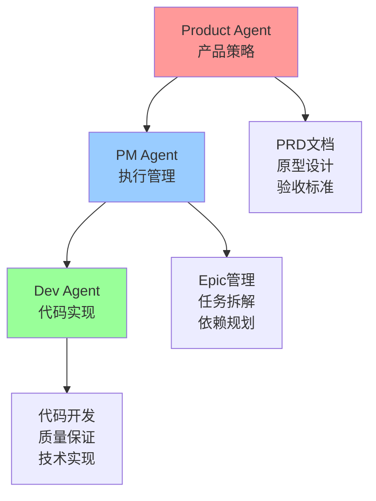

# Agent角色协作指南

> 明确各Agent角色边界，优化协作效率，避免职责重复

## 角色定位概览



## 核心职责分工

### 🎯 Product Agent - "战略层"
**定位**: 产品策略与需求设计
**核心问题**: "做什么？为什么？"

**主要职责**:
- 用户需求洞察和优先级排序
- 产品功能设计和范围定义
- PRD文档输出和验收标准制定
- 上线后数据分析和产品迭代

**输出标准**:
- `docs/PRD/<topic>.md` - 完整产品需求文档
- 交互原型或线框图链接
- 明确的DoD和成功指标定义

### 📊 PM Agent - "执行层"  
**定位**: 项目管理与执行协调
**核心问题**: "怎么做？何时交付？"

**主要职责**:
- 基于PRD进行任务拆解和Epic创建
- 构建任务依赖图，规划并行开发
- 协调开发资源，跟踪项目进度
- 质量把关和发布计划管理

**输出标准**:
- Epic Issues with依赖关系图
- 具体开发任务(backend/api/docs)
- Sprint计划和里程碑管理

### 💻 Dev Agent - "实现层"
**定位**: 代码开发与技术实现  
**核心问题**: "如何编码实现？"

**主要职责**:
- 严格按照AGENT_ONBOARDING.md流程开发
- 基于最新main分支创建功能分支
- 代码质量保证和技术方案实现
- PR创建和代码review参与

## 协作流程设计

### 阶段1: 产品规划 (Product主导)
```
Product输入 → 用户研究 → PRD文档 → 验收标准
   ↓
交付给PM: 完整的功能需求和设计方案
```

### 阶段2: 执行规划 (PM主导)
```
PRD输入 → 技术评估 → Epic创建 → 任务拆解 → 编译兼容性检查 → 依赖图构建
   ↓
交付给Dev: 具体的开发任务和依赖关系
```

### 阶段3: 开发实现 (Dev主导)
```
Issue输入 → 分支创建 → 代码开发 → 质量检查 → PR创建
   ↓
交付给PM: 完成的功能代码和文档
```

### 阶段4: 验收上线 (Product + PM协作)
```
功能演示 → Product验收 → PM发布协调 → 数据跟踪 → 迭代优化
```

## 协作边界约定

### ✅ 各角色专属职责

**Product独有**:
- 用户访谈和需求调研
- 产品方案设计和原型制作  
- A/B测试设计和数据分析
- 竞品分析和市场洞察

**PM独有**:
- Epic和Issue的创建管理
- 任务依赖图构建和批次规划
- 编译兼容性分析和原子性任务设计
- 开发进度跟踪和阻塞处理
- 发布计划和集成测试协调

**Dev独有**:
- 代码编写和技术实现
- 分支管理和PR创建
- 代码质量保证和测试
- 技术方案评估和优化

### 🚫 避免重复的职责

**不要重复**:
- ❌ Product和PM都创建Epic
- ❌ PM和Dev都做技术方案设计
- ❌ 多个角色同时管理相同的Issues
- ❌ 重复的看板状态跟踪

## 任务拆解编译兼容性原则

> 🚨 **关键原则**: 每个Issue必须能够独立编译通过，避免循环依赖陷阱

### 🎯 核心要求: 原子性可编译

**每个开发任务必须满足**:
- ✅ `make lint && make test && make build` 独立通过
- ✅ 不依赖其他未完成任务的代码变更
- ✅ 不破坏现有功能的编译和运行

### ❌ 禁止的拆解方式

**按架构分层拆解** (导致编译依赖链):
```
❌ 错误示例:
- Task A: 修改Model层数据类型
- Task B: 修改Service层业务逻辑  ← 依赖A，但A会破坏B的编译
- Task C: 修改Handler层接口响应 ← 依赖B，形成依赖链

问题: Task A单独合并会导致编译失败，无法独立完成
```

**接口变更不包含实现同步**:
```
❌ 错误示例:
- Task A: 修改API契约定义
- Task B: 修改相应的Handler实现

问题: Task A会导致Handler编译错误，必须同时修改
```

### ✅ 推荐的拆解方式

**垂直切片拆解** (包含完整调用链):
```
✅ 正确示例:
- Task A: 用户订单状态枚举升级
  - 枚举常量定义
  - Model字段类型变更
  - Service层状态逻辑更新
  - 相关测试用例修复
  - 数据库迁移脚本

结果: Task A可独立编译通过，功能完整
```

**渐进式兼容迁移**:
```
✅ 正确示例:
- Phase 1: 添加新枚举常量 + 兼容转换函数
- Phase 2: 机器管理模块完整迁移
- Phase 3: 订单管理模块完整迁移  
- Phase 4: 清理过渡期兼容代码

结果: 每个Phase都保持编译通过，渐进式演进
```

### 🔍 拆解前检查清单 (PM Agent必须执行)

**编译影响分析**:
- [ ] 识别变更涉及的所有文件和模块
- [ ] 检查类型变更的传播范围
- [ ] 分析强依赖和弱依赖关系
- [ ] 评估测试用例的同步修改需求

**依赖关系验证**:
- [ ] 确认任务间无循环依赖
- [ ] 验证并行任务无编译冲突
- [ ] 检查数据库变更与代码变更的同步性
- [ ] 确保向后兼容性或提供迁移路径

**原子性验证**:
- [ ] 每个任务可独立从main分支开发
- [ ] 合并后不破坏CI/CD检查
- [ ] 功能完整，不存在"半成品"状态
- [ ] 包含必要的测试用例和文档更新

### 📋 技术债务控制策略

**类型系统变更**:
- 设计向后兼容的过渡方案
- 提供类型转换工具函数
- 分模块渐进式迁移，避免大爆炸式更新

**接口变更管理**:
- API契约变更必须包含实现同步
- 使用版本化策略支持渐进升级
- 提供废弃通知和迁移文档

**数据库schema变更**:
- 迁移脚本与模型定义同步更新
- 支持回滚的数据迁移策略
- 生产环境分阶段部署验证

### 🏆 最佳实践示例

**案例: 枚举类型系统重构**

❌ **错误拆解** (导致Issue #34的问题):
```
Epic #31: 修复枚举类型不一致问题
├── #32: 定义枚举常量                    ✅ 可独立完成
├── #33: 修改Machine模型                 ❌ 依赖服务层修复
├── #34: 修改Order模型                   ❌ 依赖服务层修复  
├── #35: 修改服务层逻辑                   ❌ 依赖#33/#34
└── #36: 修改API响应格式                  ❌ 依赖#35

问题: #34单独合并导致编译失败，#35依赖#34但#34需要#35支持
```

✅ **正确拆解**:
```
Epic #31: 修复枚举类型不一致问题
├── #32: 枚举基础设施 + 兼容工具函数        ✅ 独立完成
├── #33: 机器管理完整枚举迁移              ✅ 垂直切片，包含Model+Service+Test
├── #34: 订单管理完整枚举迁移              ✅ 垂直切片，包含Model+Service+Test
└── #35: API响应格式统一升级               ✅ 基于完成的迁移，统一响应格式

优势: 每个任务独立可编译，无循环依赖，支持并行开发
```

### 🚨 常见陷阱与解决方案

**陷阱1: 过度追求任务颗粒度**
- 问题: 将相互依赖的代码拆分到不同任务
- 解决: 以"最小可编译单元"为边界，保持功能完整性

**陷阱2: 忽略测试用例的编译依赖**  
- 问题: 修改生产代码后，测试代码编译失败
- 解决: 代码变更必须包含相应的测试用例更新

**陷阱3: 数据库迁移与代码变更不同步**
- 问题: 模型定义更新但迁移脚本滞后
- 解决: 数据库相关变更必须包含完整的迁移和回滚脚本

### 📊 检查工具和流程

**自动化检查**:
- 任务分支创建后立即运行 `make lint && make test`
- PR合并前强制通过所有CI检查
- 使用pre-commit hooks防止编译错误提交

**人工审核节点**:
- PM创建Epic后，Dev Agent技术可行性审核
- 任务拆解完成后，架构师编译兼容性审核  
- PR创建前，自我检查编译兼容性清单

## 沟通与交接规范

### 📋 标准交付物

**Product → PM**:
- ✅ PRD文档 (`docs/PRD/<topic>.md`)
- ✅ 交互原型链接
- ✅ 验收标准checklist
- ✅ 成功指标定义

**PM → Dev**:
- ✅ Epic Issue (含依赖图)
- ✅ 具体开发任务Issues
- ✅ 批次规划和并行方案
- ✅ 文件冲突预警

**Dev → PM + Product**:
- ✅ 完成的功能代码
- ✅ PR和代码review
- ✅ 技术文档更新
- ✅ 质量检查报告

### 🗓️ 关键沟通节点

1. **需求澄清会** (Product + PM)
   - PRD完成后，PM深度理解需求细节
   - 评估技术可行性和资源需求

2. **任务规划会** (PM + Dev)  
   - Epic完成后，Dev理解开发任务
   - 评估技术实现方案和工期

3. **功能演示会** (All)
   - 功能完成后，Product验收和反馈
   - PM确认交付质量，Dev展示技术实现

4. **数据复盘会** (Product + PM)
   - 功能上线后，分析数据和用户反馈
   - 制定下一步优化计划

## 工具和模板标准

### Issue标签规范
```yaml
领域标签:
  - product     # Product Agent创建的需求类Issue
  - epic        # PM Agent创建的Epic任务
  - backend     # Dev Agent的后端开发任务
  - api         # API相关任务
  - docs        # 文档相关任务

优先级标签:
  - priority-high    # P0，必须本Sprint完成
  - priority-medium  # P1，重要但可延期  
  - priority-low     # P2，有时间再做

状态标签:
  - in-progress # 正在进行中
  - blocked     # 被阻塞，需要协调
  - review      # 等待review或验收
```

### 文档目录约定
```
docs/
├── PRD/                    # Product输出的PRD文档
│   ├── feature-a.md
│   └── feature-b.md
├── Sprint/                 # PM输出的Sprint计划
│   ├── Sprint-2025-08-5.md
│   └── Sprint-2025-08-6.md  
├── AGENT_ONBOARDING.md     # Dev开发流程规范
├── PM_ONBOARDING.md        # PM管理流程规范
└── PRODUCT_ONBOARDING.md   # Product设计流程规范
```

## 常见协作问题及解决

### 问题1: 需求频繁变更
**原因**: Product研究不充分，PM未做好变更影响评估
**解决**: 
- Product在PRD阶段做充分用户验证
- PM建立需求变更评估机制，量化影响范围

### 问题2: 开发任务阻塞
**原因**: 依赖关系不清晰，任务拆解违反编译兼容性原则
**解决**:
- 遵循"任务拆解编译兼容性原则"进行任务设计
- 使用TASK_DEPENDENCY_PLANNING.md规范依赖管理
- PM每日检查blocked任务，24h内响应
- 识别循环依赖时，立即重新设计任务边界

### 问题3: 交付质量不符预期  
**原因**: 验收标准不明确，Product参与度不够
**解决**:
- PRD阶段明确具体的验收checklist
- Product必须参与功能演示和验收

### 问题4: 重复工作和职责混乱
**原因**: 角色边界不清晰，缺乏协作规范
**解决**:
- 严格按照本文档的职责分工执行
- 定期团队对齐，澄清协作边界

## 成功协作的关键指标

### 效率指标
- **需求理解准确率**: PM对PRD的理解一次到位 >90%
- **任务拆解合理性**: 开发任务粒度合适，依赖清晰 >95%
- **编译兼容性达标率**: 任务独立编译通过率 100%
- **开发阻塞解决速度**: blocked任务24h内得到响应 >90%

### 质量指标  
- **功能验收通过率**: 首次演示通过Product验收 >85%
- **代码质量**: lint + test + build通过率 100%
- **用户满意度**: 新功能用户满意度评分 >4.0/5.0

### 协作指标
- **沟通效率**: 关键决策24h内文档化落地 >90%
- **交付及时性**: Sprint目标按时完成率 >80%
- **变更控制**: 需求变更影响评估覆盖率 100%

---

**遵循清晰的角色分工，打造高效协作团队！** 🚀

*最后更新：2025-08-12*